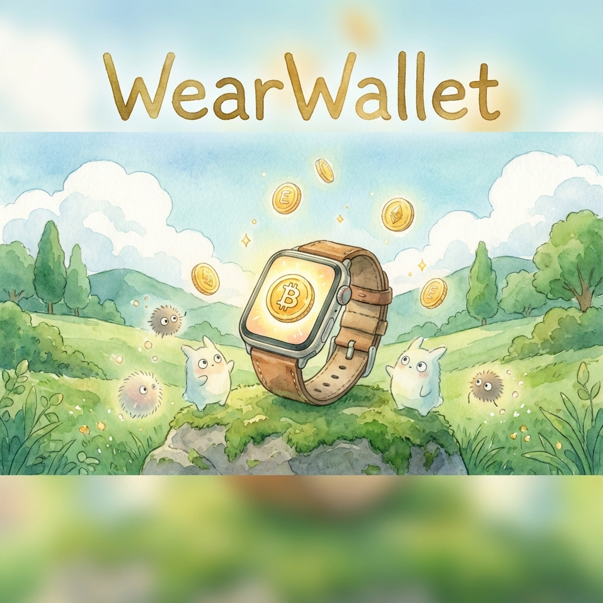
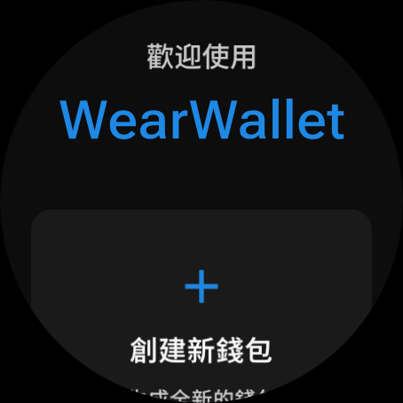
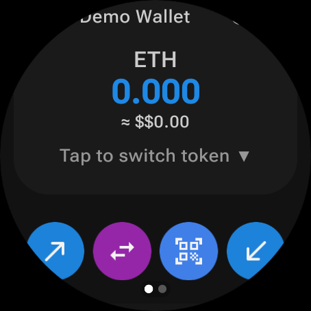
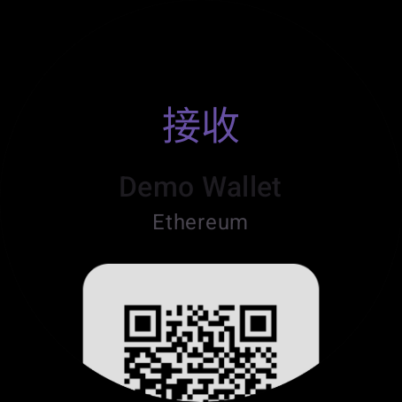
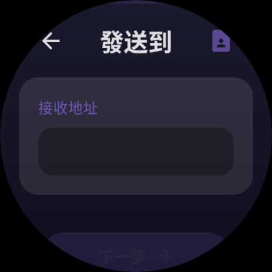
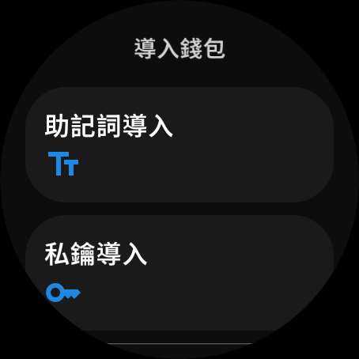
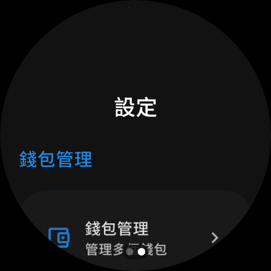

<div align="center">

**English** | **[繁體中文](./docs/zh-TW/README.md)**

# WearWallet



A wearable-first cryptocurrency wallet project spanning Wear OS, Android,
watchOS, and shared Kotlin Multiplatform code.

</div>

> [!IMPORTANT]
> This public repo (`ImL1s/WearWallet-Multiplatform`) is the **canonical development
> tree**. The private repo (`ImL1s/WearWallet`) is frozen as a historical / ops
> vault **forever**. Do **not** force-export from private over this `main` as
> ongoing sync. Do **not** rewrite private git and push it here. This tree has
> **no private development history** — last sanitized orphan
> export from private tip `8be876e`
> (`8be876ef60d7d27418232a799f1c1a93aa3b0ca7`). Do **not** use with real funds. It is not a security audit, release
> certification, or guarantee of safe use. See
> [`docs/PUBLIC_BUILD.md`](./docs/PUBLIC_BUILD.md) and
> [`docs/PUBLIC_SNAPSHOT.md`](./docs/PUBLIC_SNAPSHOT.md).

## Repository map

| Path | Purpose |
| --- | --- |
| [`wear/`](./wear/) | Wear OS application |
| [`mobile/`](./mobile/) | Android companion application |
| [`watchos/`](./watchos/) | Native watchOS application (`WatchWallet.xcodeproj`) |
| [`coreKmp/`](./coreKmp/) | Shared Kotlin Multiplatform business, data, and security code |
| [`modules/`](./modules/) | Focused Kotlin libraries used by the applications and core module (vendored as plain trees here — see below) |
| [`TrustWalletBridge/`](./TrustWalletBridge/) | Experimental iOS-only CocoaPods bridge; not a Gradle module, not watchOS, not public CI |
| [`iosApp/`](./iosApp/) | Experimental iOS companion leftovers; not the supported entry |

The active Gradle modules are defined in
[`settings.gradle.kts`](./settings.gradle.kts). Historical design and migration
documents may mention modules that no longer exist; use the current Gradle
configuration and source tree as the implementation source of truth.

## What is in the project

Capability claims are **only** those in the
[feature status matrix](./docs/FEATURE_STATUS.md). That matrix (and
`WearCapability` / `FeatureMaturity` in Wear navigation) is the source of
truth. Do not infer support from screenshots, TODOs, or historical docs.

- Wear OS and Android Compose application modules
- A native SwiftUI watchOS application
- Kotlin Multiplatform targets for Android, iOS, and watchOS
- Wallet, address book, token, transaction, and price-related domain code
- QR-based Keystone integration components
- A public Ubuntu CI workflow (`.github/workflows/ci.yml`: **Fail-closed unit
  slice**, Wear debug assemble, Markdown links, release-manifest job,
  PAT-fallback guard) and a prerelease workflow (`.github/workflows/release.yml`).
  That unit slice is still not private-grade issue #30 completeness.

## Wear OS preview

Example flows from the Wear OS debug build (experimental UI, not a security audit):

<p align="center">
  
  
  
  
  
  
</p>

On a Wear OS **debug emulator**, a local QA overlay can fill QR / token /
history / contact flows. That overlay is not mainnet data. See
[Wear QA harness](./docs/WEAR_QA_HARNESS.md).

See [docs/SCREENSHOTS.md](./docs/SCREENSHOTS.md) for the full gallery and capture notes.

## Quick start

### Prerequisites

- JDK 17
- Android SDK 35
- macOS and Xcode for Apple targets
- Optional GitHub Packages credentials only if TrustWallet Core resolution 401s
  (CI uses the job `GITHUB_TOKEN`, not a maintainer PAT)

The repository uses the checked-in Gradle 8.13 wrapper and Kotlin 2.2.21.

### Configure and build

```bash
git clone https://github.com/ImL1s/WearWallet-Multiplatform.git
cd WearWallet-Multiplatform
```

`modules/` here is a **flattened, plain-tree vendoring** of each library at
the pinned SHA from the last sanitized export — there is no `.gitmodules`
and nothing to `git submodule update`. If you need the independently-versioned
library repositories, see each library's own upstream GitHub repository.

```bash
# Public snapshot: no google-services.json. Tracked gradle.properties has no
# github.token. CI falls back to the job GITHUB_TOKEN when GH_TOKEN_PACKAGES
# is empty; fork PRs do not get github.token in gradle.properties.
./gradlew :wear:assembleDebug -PpublicSnapshot=true
./gradlew :mobile:assembleDebug -PpublicSnapshot=true

# watchOS (macOS + Xcode + CocoaPods). Pods are not committed.
# build-kmp.sh runs pod install and creates a local WearWallet.xcworkspace.
# Open that workspace (not WatchWallet.xcodeproj) so the Pods target is included.
cd watchos && ./build-kmp.sh && open WearWallet.xcworkspace
```

The root `gradle.properties` file is tracked and contains shared build settings;
never add credentials to it. Do not commit `.env`, signing files, or API keys.
See [`docs/PUBLIC_BUILD.md`](./docs/PUBLIC_BUILD.md) for the supported public
setup, credentials, and validation commands.

## Releases

Experimental **debug** packages (Wear APK + source tarball) are on
[GitHub Releases](https://github.com/ImL1s/WearWallet-Multiplatform/releases)
as prereleases. They are not Play-signed and **not for real funds**.
How a tag is cut: [`docs/PUBLIC_BUILD.md`](./docs/PUBLIC_BUILD.md).

## Verification

Run the smallest checks that cover your change:

```bash
# Documentation
./scripts/check_markdown_links.py

# Shared core and Wear OS unit tests
./gradlew :coreKmp:testDebugUnitTest :wear:testDebugUnitTest -PpublicSnapshot=true

# Wear OS debug build
./gradlew :wear:assembleDebug -PpublicSnapshot=true
```

Wear debug emulator overlay (not mainnet): [Wear QA harness](./docs/WEAR_QA_HARNESS.md).

Apple target checks require macOS. Emulator, simulator, and automated test
results do not prove physical Keystone, watch, phone, or mainnet behavior.

## Documentation

Start at the **[documentation index](./docs/README.md)**.

- [Feature status matrix](./docs/FEATURE_STATUS.md)
- [Third-party / vendored license inventory](./docs/THIRD_PARTY.md)
- [Public build notes](./docs/PUBLIC_BUILD.md)
- [Public tree provenance](./docs/PUBLIC_SNAPSHOT.md)
- [Wear debug QA harness](./docs/WEAR_QA_HARNESS.md)
- [Development guide](./docs/DEVELOPMENT_GUIDE.md)
- [`coreKmp` overview](./coreKmp/README.md)
- [Contributing](./docs/CONTRIBUTING.md)

## Contributing

Contributions are welcome on this public repo. Keep changes focused, include
the validation you ran, and state any unverified platform or hardware lane.
Read [`docs/CONTRIBUTING.md`](./docs/CONTRIBUTING.md) before opening a pull
request. Large or structural contributions are best discussed in an issue first.

## License

WearWallet is available under the [GNU GPL-3.0-or-later](./LICENSE). See
[docs/LICENSING.md](./docs/LICENSING.md) and
[docs/THIRD_PARTY.md](./docs/THIRD_PARTY.md) (inventory, not legal advice).
